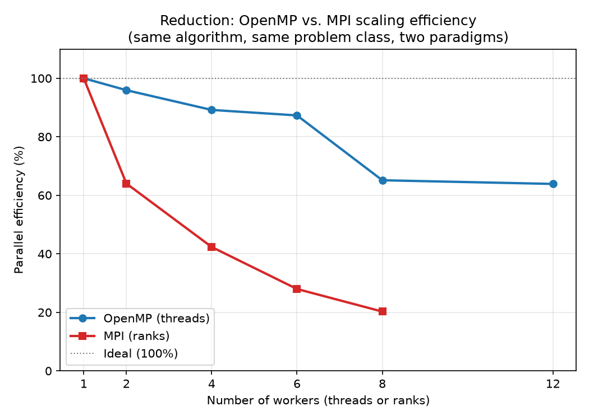
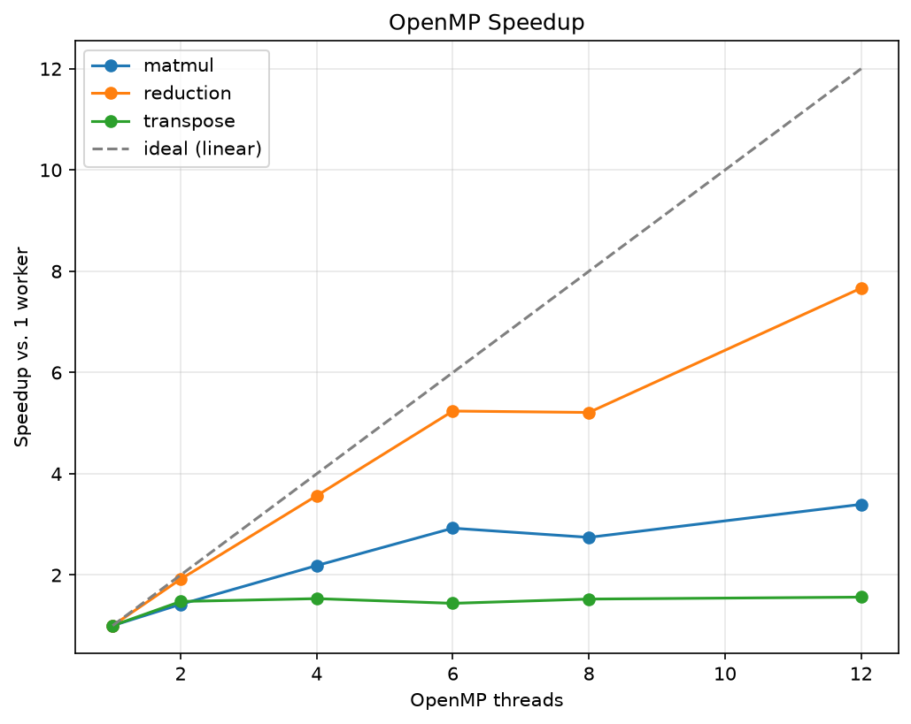
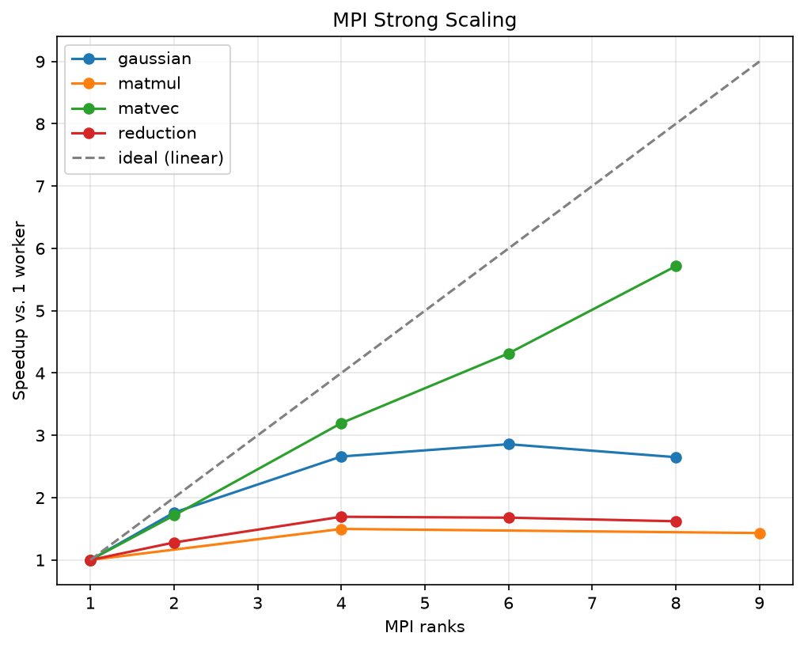
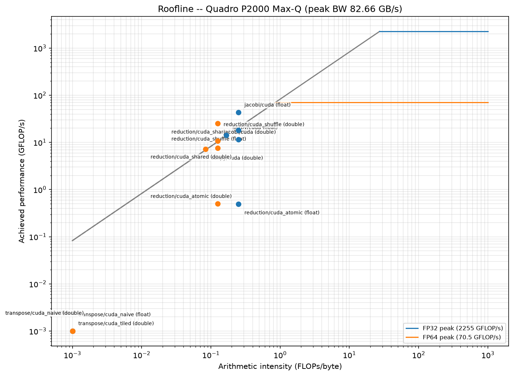

# hpc-kernels

`hpc-kernels` is a portfolio repository of classic high-performance-computing algorithms — reduction, matrix multiplication, matrix-vector multiplication, Gaussian elimination, matrix transpose, and Jacobi iteration — each implemented and benchmarked across as many of four execution paradigms as apply: serial C, OpenMP (multi-core CPU), MPI/OpenMPI (multi-process), and CUDA (GPU). Every kernel is checked for correctness against independent NumPy/SciPy oracles, and every benchmark runs through a shared harness (`common/bench.c`) that reports minimum/median timing, GFLOP/s, and GB/s rather than a bare pass/fail. Measured on an Intel Xeon E-2176M (6 cores / 12 threads, AVX2+FMA) and an NVIDIA Quadro P2000-class Pascal GPU (sm_61).

## Completeness

| Kernel | Serial | OpenMP | MPI | CUDA |
|---|:---:|:---:|:---:|:---:|
| Reduction | ✓ | ✓ | ✓ ¹ | ✓ ² |
| Matmul | ✓ | ✓ | ✓ (Cannon's) | — |
| Matvec | ✓ | — | ✓ | — |
| Gaussian elimination | ✓ | — | ✓ | — |
| Transpose | ✓ | ✓ | — | ✓ ³ |
| Jacobi | — | — | — | ✓ |
| SAXPY ⁴ | — | — | — | ✓ |

¹ Three MPI variants exist: plain, `mpi_subcomm` (sub-communicator), `mpi_omp` (hybrid MPI+OpenMP).
² Three CUDA variants: atomic, shared-memory tree, warp-shuffle — a deliberate naive→optimized progression, not three unrelated implementations.
³ Two CUDA variants: naive and shared-memory tiled — same naive→optimized pattern.
⁴ Not one of the six core algorithms — a small CUDA-only warm-up kernel used to validate the GPU measurement loop before Jacobi (per `build_plan.md`'s Phase 4 plan).

A `—` isn't a failure or something forgotten — it means that combination was never attempted, usually because the build plan only called for it in specific cases (e.g. Gaussian elimination's row-by-row dependency chain makes it a poor fit for OpenMP's shared-memory parallelism, so only serial+MPI were planned).

## Provenance

These six algorithms originated as graded coursework at KNUST. The original assignment files no longer exist — confirmed lost, not withheld — so every implementation in this repository is a **from-scratch rewrite**: written fresh against a shared benchmarking/verification harness (`common/`), built one kernel at a time, and checked against independent NumPy/SciPy reference implementations rather than against memory of the original grading criteria. This is solo, original work: no assignment text, grading rubric, or another student's code appears anywhere in this repository. Where an algorithm's structure is a well-known textbook method (e.g. Cannon's algorithm for distributed matrix multiplication), that's cited as such rather than presented as novel. Gaussian elimination deliberately skips partial pivoting: input matrices are generated diagonally dominant, which guarantees numerical stability without row searching/swapping — a trade-off chosen partly because it keeps the MPI version simpler, with no need to communicate pivot-search results across ranks.

## Build & run

**Requirements:** GCC, GNU Make, an MPI implementation (OpenMPI, via `mpicc`), and — for the GPU kernels — the CUDA 12.8 toolkit (`nvcc`). CUDA 13.x drops support for this project's target GPU architecture (Pascal, `sm_61`); do not upgrade past 12.8.

**Build everything:**
```bash
make all
```
This builds all CPU (serial/OpenMP/MPI) and GPU (CUDA) binaries into `bin/`. To build a single kernel/paradigm combination instead, use its target name directly, e.g.:
```bash
make reduction_omp
make matmul_mpi
make reduce_shuffle
```

**Precision:** every kernel is built single-precision (`float`) by default. Build double-precision instead with:
```bash
make PREC=double all
```
Note: `make` only checks file timestamps, not build flags — switching `PREC` on a binary that already exists from a prior build will **not** trigger a rebuild. Run `make clean` first if you're not sure which precision your `bin/` currently holds.

**Running a binary:** every executable takes the same three flags —
```bash
./bin/<kernel_name> -n <problem_size> -r <repetitions> -t <threads_or_ranks>
```
for example:
```bash
./bin/reduction_serial -n 100000 -r 5 -t 1
```
MPI binaries are launched with `mpirun`/`mpiexec` instead of run directly, ranks passed via `-np`:
```bash
mpirun -np 4 ./bin/reduction_mpi -n 100000 -r 5
```

**Output:** each run prints one CSV line to stdout in the fixed column order `kernel,paradigm,precision,N,threads_or_ranks,time_min,time_med,gflops,gbytes_s`, plus a human-readable verification line to stderr (relative 2-norm error and max absolute difference — never a bare pass/fail).

**Clean:**
```bash
make clean
```

## Results

**Headline: reduction, OpenMP vs. MPI.** Same algorithm, same problem class, two parallel paradigms — and very different scaling behavior:



OpenMP holds above 85% efficiency out to 6 threads and only drops sharply past the physical core count — this Xeon E-2176M has 6 physical cores, each running 2 hyperthreads (confirmed via `lstopo` topology), so threads 7–12 share cores rather than getting dedicated ones. MPI's efficiency falls almost immediately — by 2 ranks it's already down to 64%, and continues dropping — because unlike OpenMP's shared memory, every MPI rank pays real communication cost for each reduction step, even on a single machine. Same math, two different costs of parallelizing it.

**Further results:**

<p align="center">
  
  
  
</p>

*Left to right: OpenMP speedup across all kernels; MPI strong scaling across all kernels; roofline model placing every kernel, at both precisions, against the measured compute and bandwidth ceilings of the Xeon E-2176M and Quadro P2000.*
